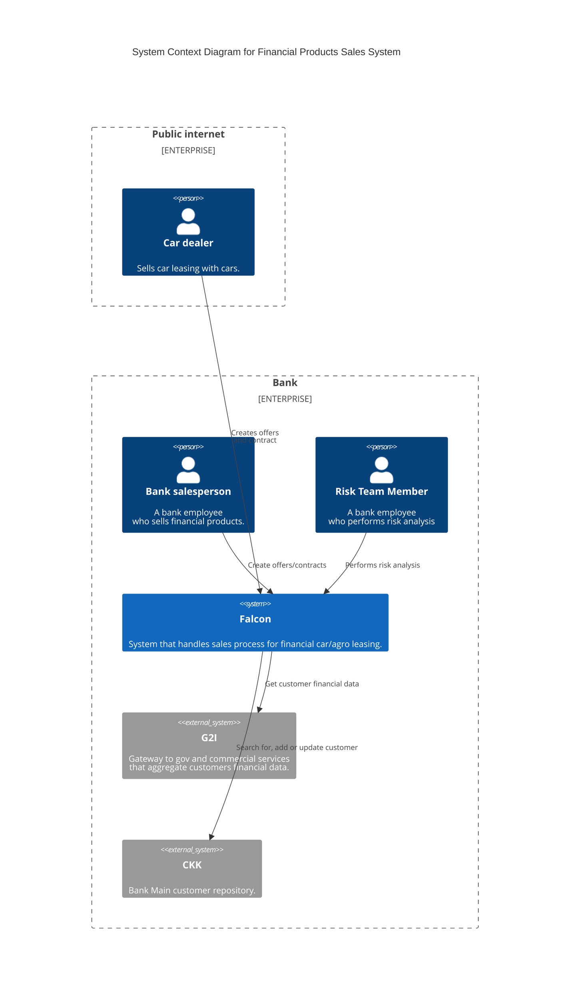
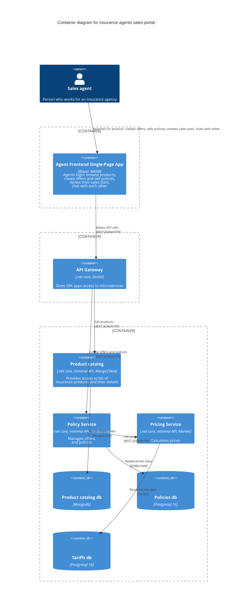
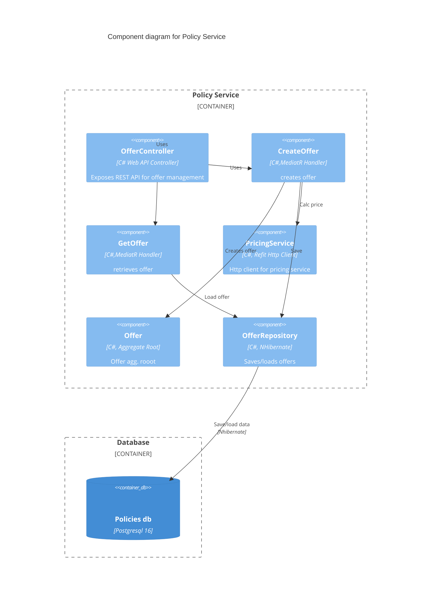

# Documemnting architecture demo repository
Below you can find sample diagrams created with Mermaid.

## System context diagram
System context diagram for a system that manages the sales process of financial products: leasing from cars and agro equipment.



## Container diagram
Container diagram that presents part of the sales portal for insurance agents.



## Component diagram
Component diagram for policy service.


```
