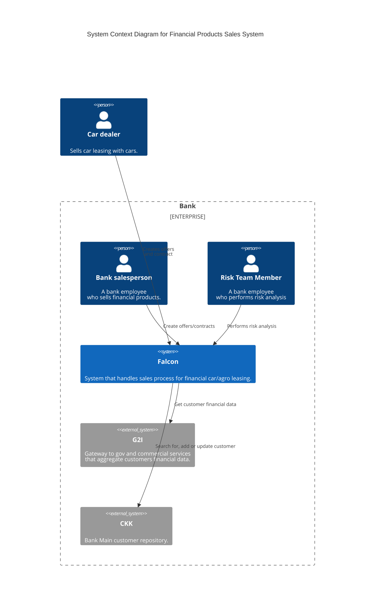
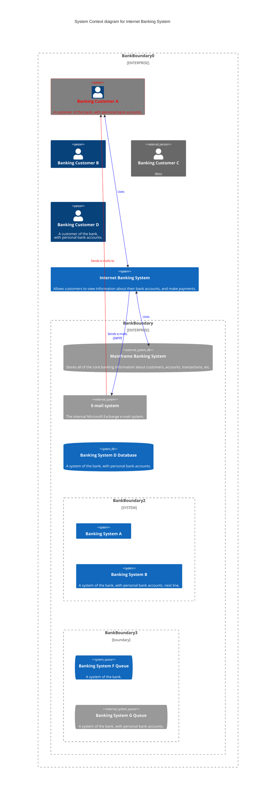

# Documemnting architecture demo repository
Below you can find sample diagrams created with Mermaid.

## System context diagram

```mermaid
    C4Context
        title System Context Diagram for Financial Products Sales System

        Person(carDealer, "Car dealer", "Sells car leasing with cars.")

        Enterprise_Boundary(b0, "Bank") {
            Person(bankSalesPerson, "Bank salesperson", "A bank employee <br/>who sells financial products.")
            Person(riskTeamPerson, "Risk Team Member", "A bank employee <br/>who performs risk analysis")

            System(falconSystem, "Falcon", "System that handles sales process for financial car/agro leasing.")

            System_Ext(g2iSystem, "G2I", "Gateway to gov and commercial services <br/>that aggregate customers financial data.")
            System_Ext(ckkSystem, "CKK", "Bank Main customer repository.")

            Rel(carDealer, falconSystem, "Creates offers<br/> and contract")
            Rel(bankSalesPerson, falconSystem, "Create offers/contracts")
            Rel(riskTeamPerson, falconSystem, "Performs risk analysis")

            Rel(falconSystem, g2iSystem, "Get customer financial data")
            Rel(falconSystem, ckkSystem, "Search for, add or update customer")
        }

        UpdateLayoutConfig($c4ShapeInRow="2", $c4BoundaryInRow="1")
```
Diagram 1

```mermaid
    C4Context
      title System Context diagram for Internet Banking System
      Enterprise_Boundary(b0, "BankBoundary0") {
        Person(customerA, "Banking Customer A", "A customer of the bank, with personal bank accounts.")
        Person(customerB, "Banking Customer B")
        Person_Ext(customerC, "Banking Customer C", "desc")

        Person(customerD, "Banking Customer D", "A customer of the bank, <br/> with personal bank accounts.")

        System(SystemAA, "Internet Banking System", "Allows customers to view information about their bank accounts, and make payments.")

        Enterprise_Boundary(b1, "BankBoundary") {

          SystemDb_Ext(SystemE, "Mainframe Banking System", "Stores all of the core banking information about customers, accounts, transactions, etc.")

          System_Boundary(b2, "BankBoundary2") {
            System(SystemA, "Banking System A")
            System(SystemB, "Banking System B", "A system of the bank, with personal bank accounts. next line.")
          }

          System_Ext(SystemC, "E-mail system", "The internal Microsoft Exchange e-mail system.")
          SystemDb(SystemD, "Banking System D Database", "A system of the bank, with personal bank accounts.")

          Boundary(b3, "BankBoundary3", "boundary") {
            SystemQueue(SystemF, "Banking System F Queue", "A system of the bank.")
            SystemQueue_Ext(SystemG, "Banking System G Queue", "A system of the bank, with personal bank accounts.")
          }
        }
      }

      BiRel(customerA, SystemAA, "Uses")
      BiRel(SystemAA, SystemE, "Uses")
      Rel(SystemAA, SystemC, "Sends e-mails", "SMTP")
      Rel(SystemC, customerA, "Sends e-mails to")

      UpdateElementStyle(customerA, $fontColor="red", $bgColor="grey", $borderColor="red")
      UpdateRelStyle(customerA, SystemAA, $textColor="blue", $lineColor="blue", $offsetX="5")
      UpdateRelStyle(SystemAA, SystemE, $textColor="blue", $lineColor="blue", $offsetY="-10")
      UpdateRelStyle(SystemAA, SystemC, $textColor="blue", $lineColor="blue", $offsetY="-40", $offsetX="-50")
      UpdateRelStyle(SystemC, customerA, $textColor="red", $lineColor="red", $offsetX="-50", $offsetY="20")

      UpdateLayoutConfig($c4ShapeInRow="3", $c4BoundaryInRow="1")


```
